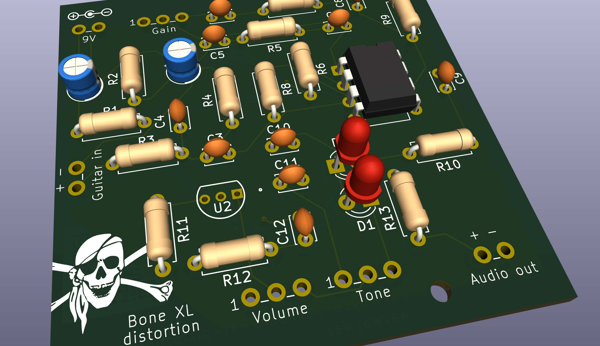
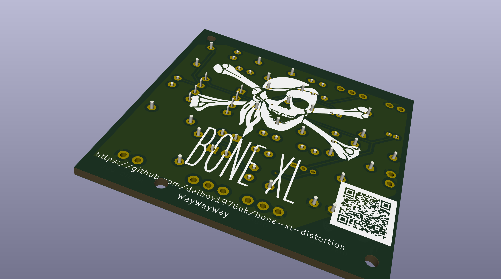

# bone xl distortion pedal

I recently got into electronics, and as a musician, I thought a guitar pedal would be a fun project. I followed this awesome tutorial by Brian Wampler of Wampler 
Pedals https://www.wamplerpedals.com/blog/lifestyle-hobby/2024/08/how-to-design-a-basic-distortion-pedal-circuit/. The circuit is slightly different (I use a 
different op-amp), but all credit for the circuit design should go to Brian. This is my first project learning and using KiCad for PCB design.

## bill of materials

| Reference               | Value      | Qty | Notes
|-------------------------|------------|-----|-----
| BT1                     | 9V         | 1   | 9v in -ve core
| C1,C2                   | 47µF       | 2   | electrolytic
| C3,C10,C11              | 22nF       | 3   | 223
| C4,C8                   | 100pF      | 2   | 101
| C5                      | 47nF       | 1   | 473
| C6                      | 50pF       | 1   | 50
| C7                      | 680nF      | 1   | 684
| C9,C12                  | 1µF        | 2   | 105
| D1,D2                   | LED        | 2   | any colour
| J1,J2                   | AudioJack2 | 2   | guitar in/out
| R1,R2,R3,R7,R11,R12,RV2 | 10kΩ       | 7   | blk brn ora
| R4,R8                   | 1MΩ        | 2   | blk brn grn
| R5                      | 4.7kΩ      | 1   | yel pur red
| R6                      | 2.2kΩ      | 1   | red red red
| R9                      | 680kΩ      | 1   | blu gre yel
| R10                     | 1kΩ        | 1   | bro blk red
| R13                     | 220Ω       | 1   | red red bro
| RV1,RV3                 | 100kΩ      | 2   | pots
| U1                      | LM358      | 1   | dual op amp
| U2                      | J201       | 1   | jfet

